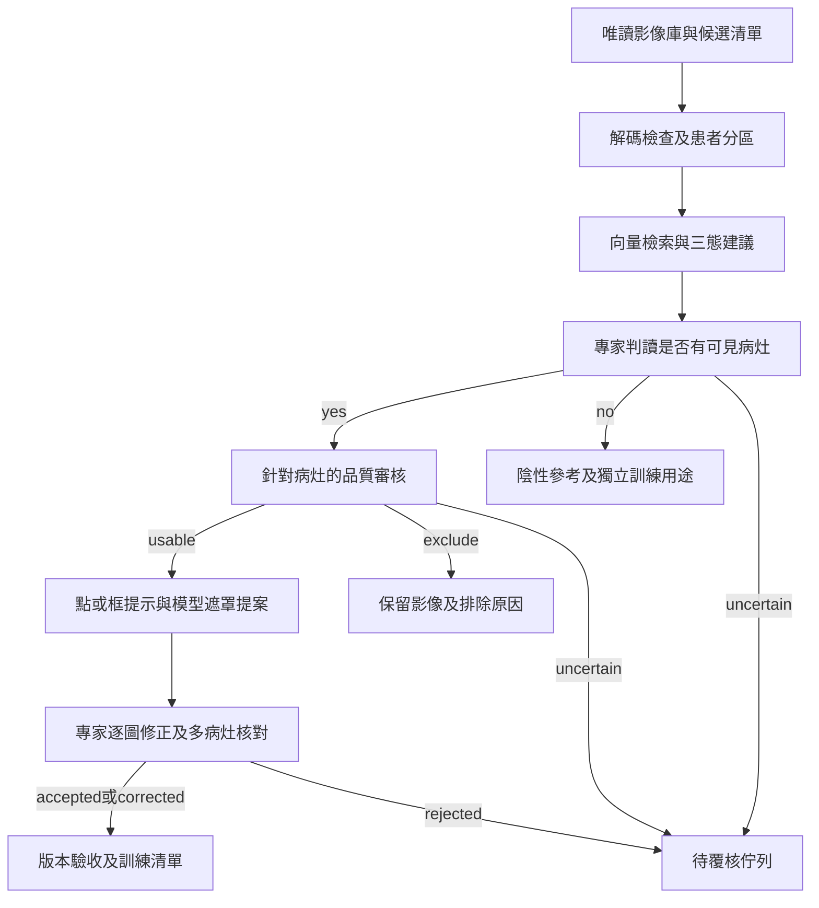

# 0. 操作總覽、責任與驗收關卡

## 0.1 這個流程回答什麼問題

一張圖依序回答：看得出病灶嗎？品質能支援指定的訓練任務嗎？病灶可見邊界在哪裡？專家是否接受這個標註？

病人的病理結果不能代替影像內病灶可見性；同一位病人可能有正常黏膜、沖水、器械、切除後傷口與病灶影像。工程師不要由資料夾或病理標籤推定整批圖都是陽性。影像檢索只找相似範例，不提供已校準的疾病機率。

## 0.2 責任分工

| 人員 | 必須完成 | 不應自行代替的決策 |
|---|---|---|
| 工程師 | 候選清單、抽樣、工具建置、模型運行、錯誤紀錄、版本追溯、幾何驗證 | 不能把未審核的模型結果簽成專家真值 |
| 初審醫師/受訓標註員 | 依已簽署規範判讀可見性、品質、畫提示與初稿；記錄不確定 | 超出訓練範圍的邊界與病灶型態交專家 |
| 覆核專家 | 制定目標病灶範圍、裁決分歧、簽署定稿和例外政策 | 閾值改動不能只口頭決定，需紀錄版本 |
| 任務負責人 | 決定召回需求、排除成本、資料用途及發布版本 | 不以「本週要完成」取代品質關卡 |

## 0.3 逐階段交接表

| 關卡 | 負責人及輸入 | 必交付 | 放行條件 |
|---|---|---|---|
| G0 資料盤點 | 工程師；指定來源與 lake 索引 | 候選清單、雜湊、解碼報告、批次設定 | 所有列能對到影像或明確錯誤；無默默漏列 |
| G1 判讀規範 | 專家；分層小樣本 | 簽署規範、患者分区、範例庫、分歧裁決 | 每個例子含 yes/no/uncertain 與理由；資料角色無患者重疊 |
| G2 檢索 | 工程師+專家；G1 | Encoder/索引版本、近鄰證據、三態建議、獨立驗證 | 閾值凍結；達到事先同意的召回與審核量目標，否則全人工初篩 |
| G3 品質 | 專家；病灶陽性或陰性任務清單 | 原始品質指標、原因碼、任務可用性 | `uncertain` 不放行；blur pass 不等同品質 pass |
| G4 分割 | 工程師+專家；陽性且 usable | Prompt、提案、逐圖覆核、定稿遮罩 | 每個可見目標病灶都被處理；mask 與原圖對齊 |
| G5 發布 | 工程師+負責人；G4 | 不可覆寫的 release、資料卡、統計、驗收報告 | 無未審核列、跨 split 患者重疊或無法追溯的 mask |

所有效能門檻要在看最終測試結果前寫入規範；手冊中的樣本量、工期與候選模型均是起始規劃，不是已驗證成果。

## 0.4 兩種使用方式

**先做小批次人工流程**：候選匯出 → 人工分層抽樣 → 專家可見性與品質判讀 → 人工 mask。這條路可先累積校準資料；不需要等所有模型完成。

**工具開發完成後**：同一資料契約接上檢索、品質指標與 SAM，以減少人工工時。初期所有訓練影像仍逐圖覆核。只有另行驗證過且被負責人簽署的政策，才能改變覆核比例。

## 0.5 每次工作留下的證據

在 `outputs/<run_id>/` 保存設定快照、候選 SHA256、程式 commit 及未提交差異、模型版本/權重 SHA256、環境套件版本、抽樣 seed、操作人、開始/結束時間、輸入/成功/失敗數、例外處理結果。這些都是任務產物，不進 Git。Git 只放程式、無個資設定和本手冊。

讀者若單獨拿到本資料夾，仍需能連到主 repo 的 `shared_image_lake/` 與 `.venv`；複製本資料夾並不等於已取得資料集或模型。
